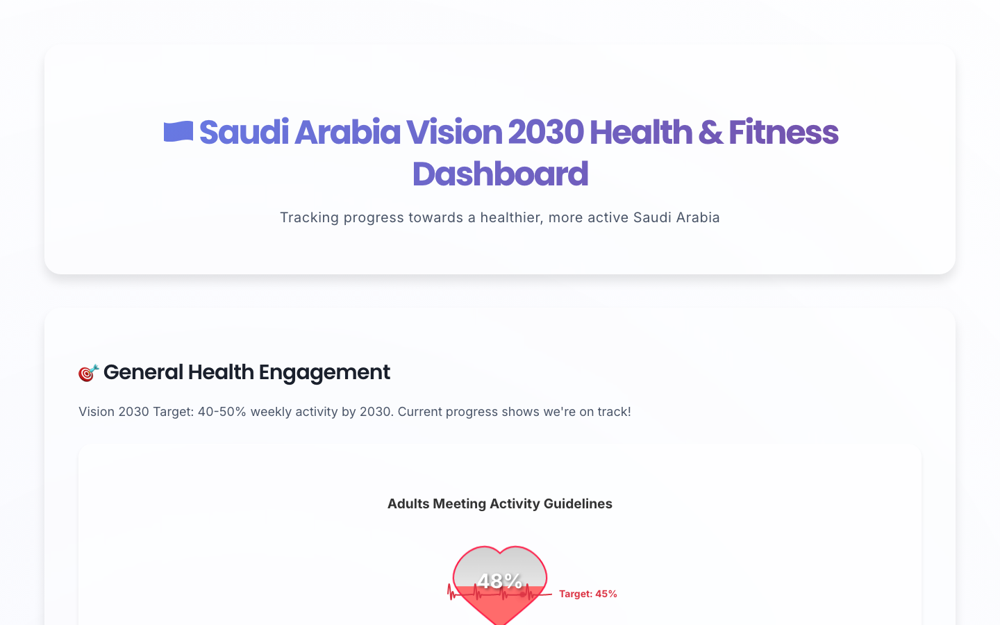
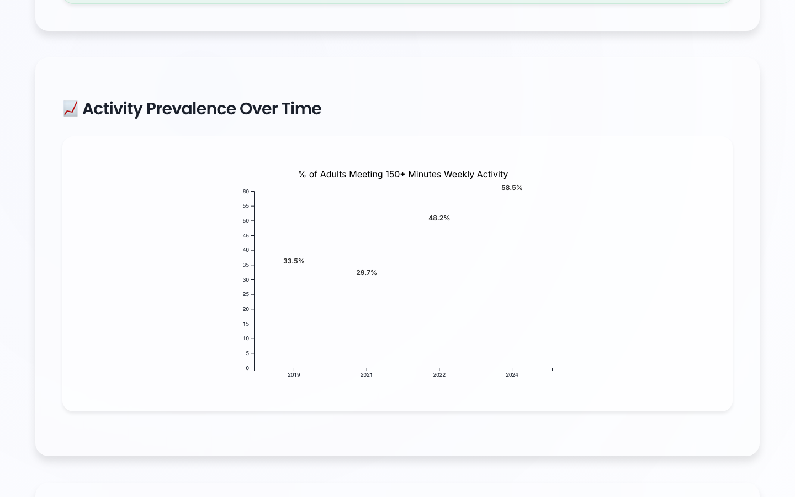

# Saudi Arabia Vision 2030 Health & Fitness Dashboard

An interactive dashboard tracking Saudi Arabia's progress toward Vision 2030 health goals — physical activity, sports investment, Olympic participation, and healthy-lifestyle indicators — built with **React, TypeScript, and hand-rolled D3 charts** (no chart library).

**🔗 Live demo: [faisal-almugesib.github.io/health-awareness-dashboard](https://faisal-almugesib.github.io/health-awareness-dashboard/)**

## Preview





## Charts

All charts are built from scratch with D3 v7 as reusable typed React components:

- **GaugeChart** — activity progress vs. the Vision 2030 target
- **MultiLineChart** — multi-series trends with legend and rotated axis labels
- **BarChart** — categorical comparisons
- **LightPollutionChart** — custom visualization of healthy-lifestyle indicators

Data lives in `public/data/*.csv` and is loaded with `d3.csv` at runtime.

## Stack

- React 18 + TypeScript (Create React App)
- D3 v7 for all visualization
- CSS modules / plain CSS for styling

## Run Locally

```bash
npm install
npm start        # http://localhost:3000
npm run build    # production build
```
