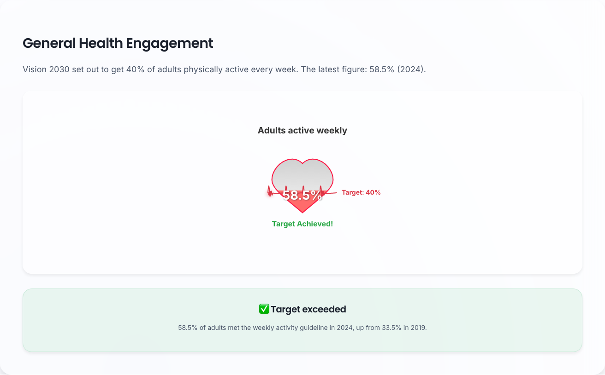
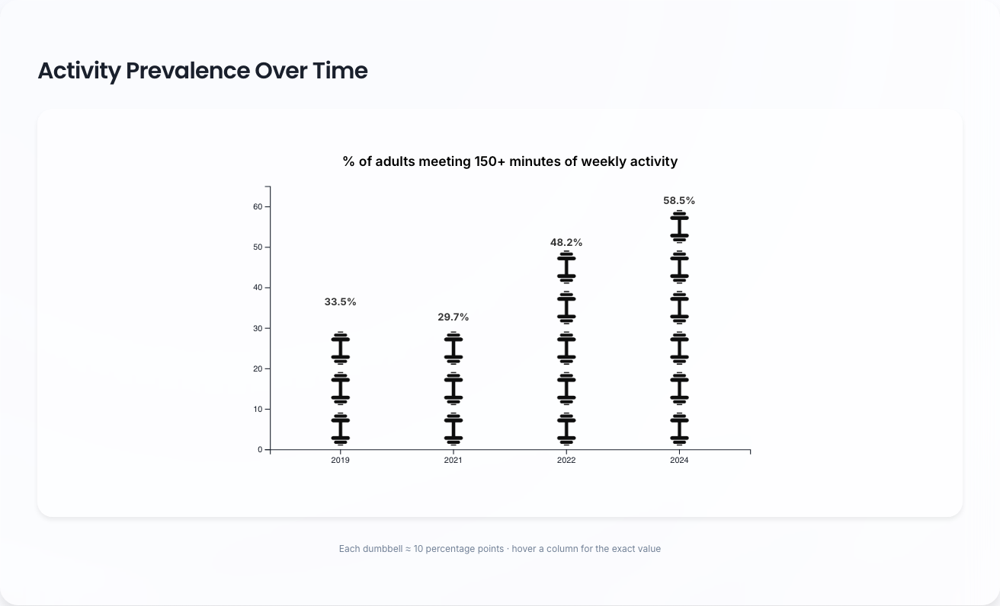
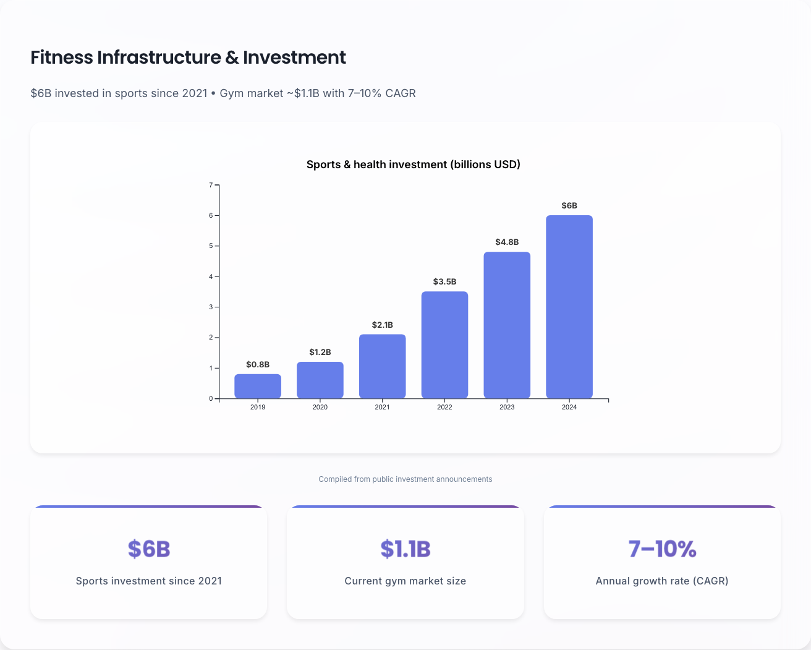
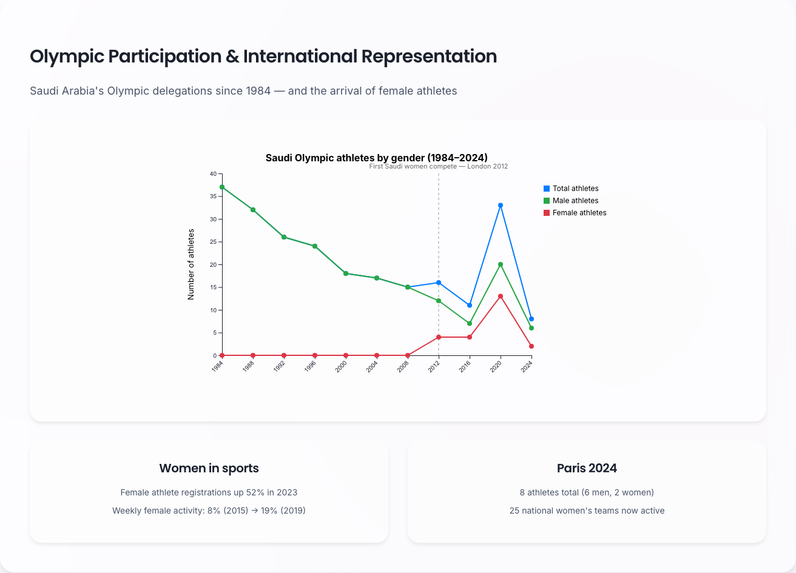

# Saudi Arabia Vision 2030 Health & Fitness Dashboard

An interactive dashboard tracking Saudi Arabia's progress toward Vision 2030 health goals — physical activity, sports investment, and Olympic participation — built with **React, TypeScript, and hand-rolled D3 charts** (no chart library).

**🔗 Live demo: [faisal-almugesib.github.io/health-awareness-dashboard](https://faisal-almugesib.github.io/health-awareness-dashboard/)**

## Preview

| Activity gauge | Dumbbell pictogram |
|---|---|
|  |  |

| Investment | Olympic participation |
|---|---|
|  |  |

## Charts

All charts are built from scratch with D3 v7 as reusable typed React components, drawn in a fixed `viewBox` so they scale fluidly:

- **GaugeChart** — a filling heart showing the latest activity rate against the Vision 2030 target, with an animated ECG line marking the target level
- **BarChart** — two variants: plain animated bars, and an **ISOTYPE-style pictogram** where each dumbbell ≈ 10 percentage points of weekly activity
- **MultiLineChart** — Olympic delegations by gender since 1984, with line draw-in animation, hoverable points, and an annotation marking London 2012, the first Games with Saudi female athletes

The headline numbers (gauge value, insight cards) are derived from the CSVs at runtime rather than hardcoded. Data lives in `public/data/*.csv` and is loaded with `d3.csv`; each chart cites its source in a small caption.

## Stack

- React 18 + TypeScript (Create React App)
- D3 v7 for all visualization
- Jest + Testing Library smoke test (`npm test`), with `transformIgnorePatterns` configured for d3's ESM packages

## Run Locally

```bash
npm install
npm start        # http://localhost:3000
npm test         # run the test suite
npm run build    # production build
```
